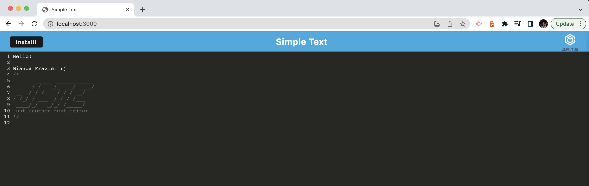
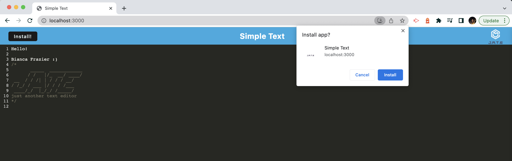

# Simple Text Editor

## Description

A PWA to write code online and offline. As well as an installable application!

## Table of Contents

- [Installation](#installation)
- [Usage](#usage)
- [License](#license)
- [Screenshots](#screenshots)
- [Questions](#questions)

## Installation

Click the 'install' button.

## Usage

This can be used to write and save code on the go.

## Screenshots

## License

MIT  
https://opensource.org/licenses/MIT

## Questions

Contact information for any questions: 
bianca.frazier90@gmail.com 
https://github.com/b-frazier/
